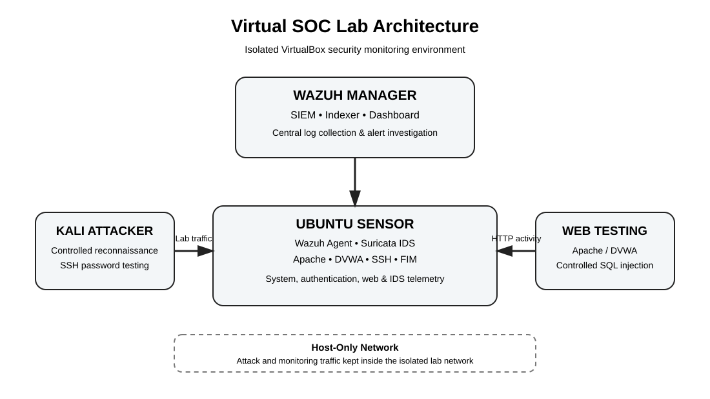

# Virtual SOC Lab

## Wazuh SIEM, Suricata IDS & Security Monitoring

A hands-on cybersecurity lab demonstrating security monitoring, attack detection, log analysis and incident investigation using open-source security tools.

The environment was built with Oracle VirtualBox and consisted of a Wazuh SIEM server, an Ubuntu monitored endpoint and a Kali Linux attack machine. Suricata, Apache, DVWA and Wazuh File Integrity Monitoring were integrated to generate and investigate network, authentication, web and host-based security events.

---

## Project Overview

Security Operations Centres (SOCs) rely on centralised monitoring and SIEM platforms to collect, analyse and investigate security events from multiple sources.

This project implemented a small virtual SOC environment to investigate how common attack activity appears across different log sources and how Wazuh can centralise and detect those events.

The lab focused on three controlled scenarios:

1. SSH reconnaissance and password-guessing activity
2. Suspicious configuration-file modification detected through File Integrity Monitoring
3. SQL injection against a deliberately vulnerable web application

The objective was to generate controlled security events and analyse the resulting logs and alerts from a security analyst perspective.

## Architecture



The attack and monitoring traffic used an isolated VirtualBox host-only network. NAT was used separately for VM internet/package updates.

## Technology Stack

| Category | Technology |
|---|---|
| Virtualisation | Oracle VirtualBox |
| SIEM | Wazuh |
| Network IDS | Suricata |
| Endpoint Monitoring | Wazuh Agent |
| File Integrity Monitoring | Wazuh FIM / Syscheck |
| Web Server | Apache |
| Vulnerable Web Application | DVWA |
| Attacker Platform | Kali Linux |
| Monitored Platform | Ubuntu Server 22.04 |
| Security Testing | Nmap, Hydra |
| Threat Framework | MITRE ATT&CK |

## Lab Components

### Wazuh Manager

Central SIEM platform used for log collection, indexing, alerting and investigation.

### Ubuntu Sensor

Monitored endpoint running the Wazuh Agent, OpenSSH, Apache, DVWA and Suricata.

### Kali Attacker

Dedicated lab machine used to generate controlled reconnaissance and authentication activity.

## Security Telemetry

The Ubuntu sensor forwarded multiple sources of security telemetry to Wazuh:

- System logs
- SSH authentication logs
- Apache access/error logs
- Suricata alerts
- File Integrity Monitoring events

## Detection Scenarios

### 1. SSH Reconnaissance

A controlled reconnaissance scan was performed against the SSH service on the Ubuntu sensor.

Suricata identified the activity and the resulting events were ingested into Wazuh. The investigation recorded **13 Suricata events** associated with the reconnaissance activity.

**Analyst focus:** network IDS telemetry, source/destination information, service identification and SIEM investigation.

### 2. SSH Password-Guessing Activity

A controlled SSH password-guessing test was performed from the Kali machine using a limited password list.

Wazuh's SSH log decoding identified the resulting failed authentication events. The investigation recorded **five authentication attempts**, with all five appearing in Wazuh.

The controlled test reported **0 valid passwords found**.

**Analyst focus:** authentication failures, source information, event correlation and suspicious login activity.

### 3. File Integrity Monitoring

A suspicious configuration file was created and modified within the Ubuntu sensor's `/etc` directory to demonstrate host-based monitoring.

Wazuh FIM detected the modification through the Syscheck module. The event contained file integrity information including size, modification timestamp and cryptographic hash changes.

The event was assigned **rule level 7** and described as an integrity checksum change.

**Analyst focus:** unauthorised configuration changes, file integrity and potential persistence indicators.

### 4. SQL Injection Detection

DVWA was hosted through Apache on the Ubuntu sensor as a deliberately vulnerable web application. A controlled SQL injection test was performed against the application.

The resulting HTTP activity was recorded in Apache access logs and collected by Wazuh. The event was classified as a **Level-6 Web Attack** and associated with **MITRE ATT&CK T1190 – Exploit Public-Facing Application**.

**Analyst focus:** web-access telemetry, suspicious requests, SIEM classification and ATT&CK mapping.

## Detection Results

| Scenario | Data Source | Detection | Result |
|---|---|---|---|
| SSH reconnaissance | Suricata | Network IDS alert | 13 events observed |
| SSH password guessing | SSH authentication logs | `sshd` detection | 5/5 attempts detected |
| Configuration modification | Wazuh FIM | Integrity change alert | Rule level 7 |
| SQL injection | Apache access logs | Web attack detection | Level-6 web attack |

## MITRE ATT&CK Mapping

| Activity | Mapping |
|---|---|
| SSH password guessing | T1110 – Brute Force |
| Persistence-related configuration modification | TA0003 – Persistence |
| SQL injection / web application exploitation | T1190 – Exploit Public-Facing Application |

See [`mitre/attack-mapping.md`](mitre/attack-mapping.md) for the project mapping.

## SOC Investigation Workflow

```text
Controlled Activity
        |
        v
Security Event Generated
        |
        +---- SSH Authentication Logs
        +---- Suricata Alerts
        +---- Apache Logs
        +---- FIM Events
        |
        v
   Wazuh Agent
        |
        v
 Wazuh Manager / SIEM
        |
        v
Alert & Event Investigation
        |
        v
Source + Activity + Target
        |
        v
MITRE ATT&CK Mapping
        |
        v
Security Finding
```

## Key Findings

- Wazuh centralised telemetry from authentication, network, web and file-integrity sources.
- Suricata successfully generated alerts for the controlled SSH reconnaissance activity.
- Wazuh captured all five failed SSH authentication attempts generated during the password-guessing test.
- Wazuh FIM detected the configuration-file modification and reported integrity changes.
- Apache access logs were collected by Wazuh and used to identify the controlled SQL injection activity.

## Skills Demonstrated

- Security Operations Centre concepts
- SIEM deployment and monitoring
- Wazuh configuration and alert investigation
- Suricata integration
- Network intrusion detection
- Endpoint monitoring
- File Integrity Monitoring
- Linux security monitoring
- SSH authentication log analysis
- Apache log analysis
- Web attack detection
- Security event investigation
- Controlled attack simulation
- MITRE ATT&CK mapping
- Blue-team analysis
- Technical security reporting

## Evidence

Sanitised screenshots are included in [`screenshots/`](screenshots/). They demonstrate Wazuh dashboard operation, Suricata detection, SSH authentication monitoring and File Integrity Monitoring.

Sensitive or unnecessary personal/infrastructure information has been excluded from the portfolio evidence.

## Project Limitations

This was an academic security laboratory in an isolated virtual environment. The scenarios were deliberately controlled to generate observable security events for investigation. The results therefore demonstrate the behaviour of the configured lab rather than production SOC performance or real-world detection rates.

The environment was also intentionally small compared with an enterprise SOC.

## Disclaimer

All security testing described in this repository was conducted against intentionally configured laboratory systems for defensive security analysis and educational purposes.
